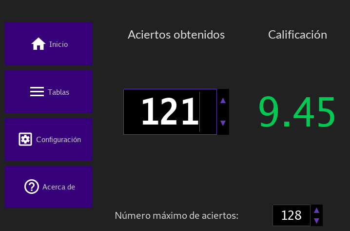
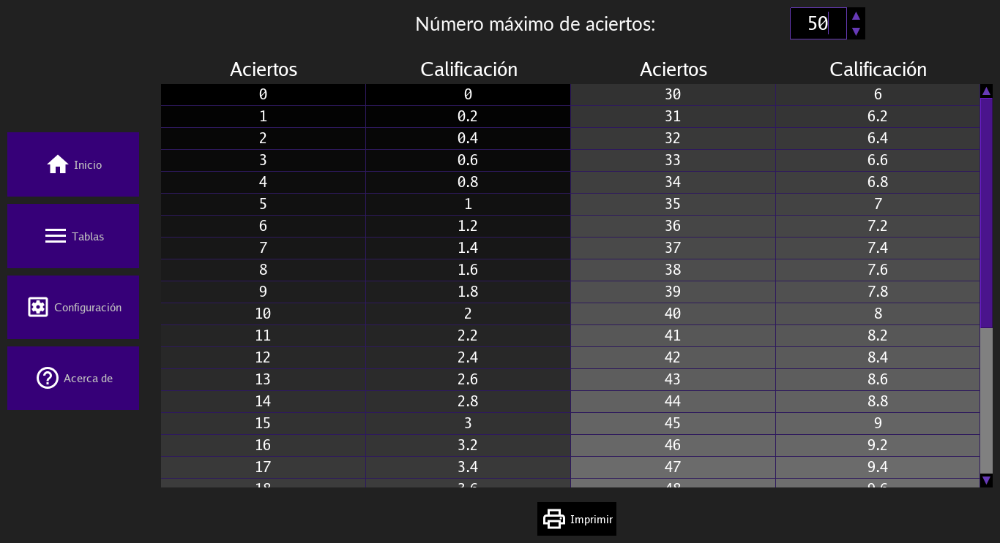

# Calificaciones

[GitHub Pages](https://benjaminguzman.github.io/Calificaciones/)

https://benjaminguzman.github.io/Calificaciones/

Calificaciones es un sencillo programa para calcular rápidamente la calificación en base a determinado puntaje obtenido sobre un puntaje máximo.

Muy útil para calificar exámenes rápidamente.

Cuenta con los siguientes features:

## Cálculo de la calificación

El punto principal de la aplicación. Ingresa el número de aciertos obtenidos y el máximo y automáticamente se mostrará la calificación obtenida.

## Tabla de calificaciones

Genera una tabla con los aciertos posibles y su correspondiente calificación. Tiene la opción de imprimir por si se requiere su uso posterior.

El proyecto es libre, si crees necesario puedes contribuir en GitHub.

## Instalación en Windows

- Descarga `windows.zip` de los https://github.com/BenjaminGuzman/Calificaciones/releases.

- (Opcional) Verifica que las firmas (checksums) correspondan, si no sabes cómo hacer esto, puedes omitir este paso.

- Descomprime `windows.zip` en cualquier directorio.

- Entra al directorio donde descomprimiste el zip y ejecuta `installer.ps1`. Si surge algún error, presiona `Win+R` y escribe `powershell`, se abrira una ventana, adentro escribe `Set-ExecutionPolicy -Scope CurrentUser Unresticted` y vuelve a ejecutar `installer.ps1`.

- Si todo salió bien deberá existir un shorcut en el escritorio de nombre _Calificaciones_, y lo puedes ejecutar para correr el programa.

- El programa quedará instalado en el directorio `%HOMEPATH%\Calificaciones`.

**Nota**: después de ejecutar el comando `Set-ExecutionPolicy -Scope CurrentUser Unresticted` es recomendable ejecutar `Set-ExecutionPoliy -Scope CurrentUser Restricted` para deshacer los cambios.

#### Desinstalación

Se debe realizar lo mismo que en la instalación, pero en vez de ejecutar `installer.ps1` se debe ejecutar `uninstaller.ps1`. En este caso no importa desde qué directorio se ejecute.
